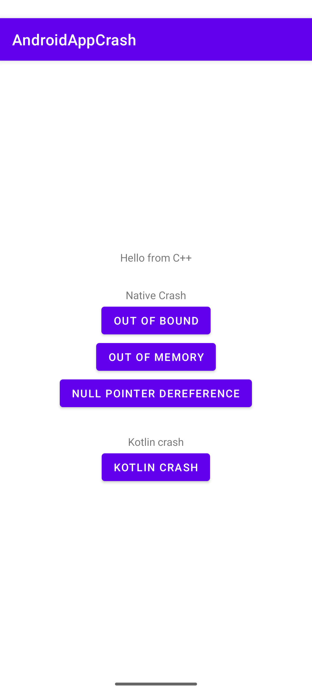

### Native Crash Reporting Sample for Android

A sample Android application written in Kotlin and C++ demonstrating how to:

- Create native crashes from C++ using JNI
- Capture native crashes on Android
- Send native crash reports to Backtrace.io

---

### Tech Stack

- Kotlin
- C++
- Android NDK
- JNI
- Backtrace.io

---

### Backtrace Configuration

Configure your Backtrace universe and submission token inside:

`strings.xml`

```xml
<resources>

    <string name="backtrace_universe">
        YOUR_UNIVERSE
    </string>

    <string name="backtrace_token">
        YOUR_SUBMISSION_TOKEN
    </string>

</resources>
```

Replace:

- `YOUR_UNIVERSE`
- `YOUR_SUBMISSION_TOKEN`

with the values from your Backtrace project.

---

### Native Crash Testing

The sample project contains multiple native crash scenarios including:

- Null pointer dereference
- Invalid memory access
- Out of bounds memory write

These crashes are generated from the C++ layer and automatically uploaded to Backtrace.io.

---

### Running the Project

1. Clone the repository
2. Open the project in Android Studio
3. Configure `strings.xml`
4. Build and run the application
5. Trigger a native crash from the app UI



---

### Backtrace Dashboard

After triggering a crash, reports can be viewed in your Backtrace project dashboard.
